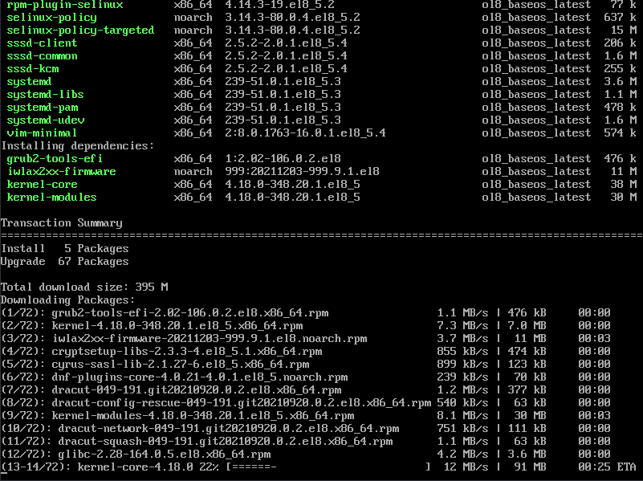

## linux_update.sh

**A Universal update script for all major distors - Debian, Ubuntu, Arch, RHEL, Fedora and openSUSE**

### Usage

**clone the repo in your home folder**

`git clone https://github.com/k1lgor/linux-update.git`

**make it executable**

`chmod +x linux_update.sh`

**run it as sudo**

`sudo ./linux_update.sh`
